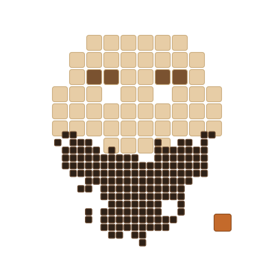

# Rodrigo Sánchez 🧉🇦🇷

`@rodrigoscz_`

### Todo es lenguaje.

Construyo cómo las marcas hablan con **humanos** y con **LLMs**.
**SEO técnico** // **AI engineering** · Correntino, escribo desde el NEA

---

### La tesis

GEO, AEO, AI Overviews, prompt engineering, copywriting, arquitectura de la información.
Parecen disciplinas distintas. **No lo son.** Todas resuelven el mismo problema:
hacer que un mensaje sea entendido (y elegido) por quien lo lee, sea una persona o un modelo.

Eso es lo que construyo, y lo que documento acá en abierto.

### En construcción

- **[lang-forge](https://github.com/rodrigoscz/lang-forge)**: AI SEO Lab. Plataforma de
  investigación para validar hipótesis de SEO sobre AI Overviews con datos reales y
  visualizaciones publicables. Experimentos repetibles, hallazgos abiertos.

### Stack

---

*Demuestro antes de declarar. Los repos de acá son la evidencia.*

